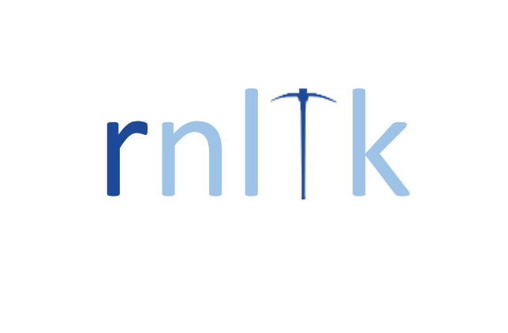

rnltk
============

**rnltk** is a natural language tool kit for R. It is inspired by
Python's [NLTK](http://www.nltk.org/) porting and extending much of
Python's functionality with some R flavor. The packages/functions that
are included are designed to be more intuitive wrappers or optimized for
performance. Currently, the package calls the following packages
maintained by me:

1.  [entity](https://github.com/trinker/entity)
2.  [formality](https://github.com/trinker/formality)
3.  [gofastr](https://github.com/trinker/gofastr)
4.  [hclustext](https://github.com/trinker/hclustext)
5.  [lexr](https://github.com/trinker/lexr)
6.  [parsent](https://github.com/trinker/parsent)
7.  [qdapRegex](https://github.com/trinker/qdapRegex)
8.  [readability](https://github.com/trinker/readability)
9.  [sentimentr](https://github.com/trinker/sentimentr)
10. [stansent](https://github.com/trinker/stansent)
11. [syllable](https://github.com/trinker/syllable)
12. [tagger](https://github.com/trinker/tagger)
13. [termco](https://github.com/trinker/termco)
14. [textproj](https://github.com/trinker/textproj)
15. [textreadr](https://github.com/trinker/textreadr)
16. [textreport](https://github.com/trinker/textreport)
17. [textshape](https://github.com/trinker/textshape)

There are plans to add to this list including outside packages, focusing
particularly on machine learning/classification packages. Please
[suggest packages and features](https://github.com/trinker/rnltk/issues)
with rationale as to how/why it would be important to include the
request in a natural language tool kit.

To see all of the available packages and functions use the `available()`
function.

Additionally, I plan to replicate and extend much of the [Natural
Language Processing with Python](http://www.nltk.org/book/) book (Bird,
Klein, & Loper, 2009) with equivalent **rnltk** code.

-   Bird, S., Klein, E., & Loper, E. (2009). *Natural Language
    Processing with Python* (1st ed.). Beijing: O'Reilly Media

Table of Contents
============

-   [[Installation](#installation)](#[installation](#installation))
-   [[Contact](#contact)](#[contact](#contact))

Installation
============

To download the development version of **rnltk**:

Download the [zip ball](https://github.com/trinker/rnltk/zipball/master)
or [tar ball](https://github.com/trinker/rnltk/tarball/master),
decompress and run `R CMD INSTALL` on it, or use the **pacman** package
to install the development version:

    if (!require("pacman")) install.packages("pacman")
    pacman::p_load_gh("trinker/rnltk")

Contact
=======

You are welcome to:   
- submit suggestions and bug-reports at: <https://github.com/trinker/rnltk/issues>   
- send a pull request on: <https://github.com/trinker/rnltk/>  

- compose a friendly e-mail to: <tyler.rinker@gmail.com>